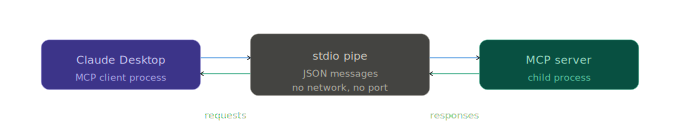
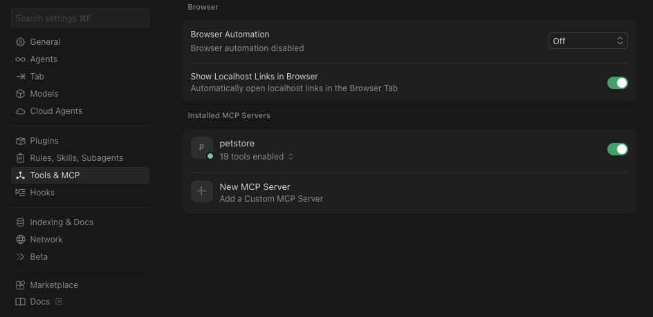

# OpenAPI MCP Server

- [OpenAPI MCP Server](#openapi-mcp-server)
  - [Scaffolding](#scaffolding)
  - [Quick start](#quick-start)
    - [Watch Out](#watch-out)
  - [VSCode](#vscode)
  - [Configuration](#configuration)
  - [What is an MCP server?](#what-is-an-mcp-server)
  - [Architecture Diagram](#architecture-diagram)
    - [How it works (the diagram above)](#how-it-works-the-diagram-above)
  - [In depth](#in-depth)
    - [1. Named tool](#1-named-tool)
    - [2. Dereferencing `$ref` pointers](#2-dereferencing-ref-pointers)
    - [3. `serve` vs `chat` — what each mode actually does](#3-serve-vs-chat--what-each-mode-actually-does)
      - [Chat Mode Flow](#chat-mode-flow)
    - [4. "The MCP server registers those tools" — which tools?](#4-the-mcp-server-registers-those-tools--which-tools)
    - [5. stdio — what is it?](#5-stdio--what-is-it)
    - [6. `list_tools` and `call_tool` — the two MCP messages](#6-list_tools-and-call_tool--the-two-mcp-messages)
  - [Cursor as MCP Client](#cursor-as-mcp-client)
    - [Step 1 — Create a config file](#step-1--create-a-config-file)
    - [Step 2 — restart Cursor](#step-2--restart-cursor)
    - [Step 3 — use it in the Cursor chat](#step-3--use-it-in-the-cursor-chat)
    - [What's actually happening](#whats-actually-happening)
    - [Watch out](#watch-out-1)
      - [When do you run each command?](#when-do-you-run-each-command)


Expose **any REST API** (described by an OpenAPI 3.x spec) as an MCP server,
so any MCP-compatible LLM client (Claude Desktop, etc.) can call it as tools.

Supports **Ollama** (local) and **Google Gemini** as LLM backends.

## Scaffolding

```bash
ai-dev-openapi-mcp-server/
├── pyproject.toml               ← uv-compatible, src layout
├── .env.example                 ← all config options documented
├── README.md
├── claude_desktop_config.example.json
├── src/openapi_mcp_server/
│   ├── cli.py                   ← typer CLI (serve / chat / list-tools)
│   ├── server.py                ← MCP server + agentic loop
│   ├── spec_loader.py           ← loads & dereferences any OpenAPI spec
│   ├── api_client.py            ← async httpx REST caller
│   └── llm_backends.py          ← Ollama + Gemini, swappable factory
└── tests/
    └── test_spec_loader.py
```

## Quick start

```bash
# Install dependencies and create .venv folder
uv sync

# Serve mode
# ----------------------------------------------------
# Run with remote OpenAPI spec
uv run openapi-mcp serve --spec https://petstore3.swagger.io/api/v3/openapi.json \

# Run with local OpenAPI spec
uv run openapi-mcp serve --spec ./my-api.yaml \

# Or use a .env file
cp .env.example .env   # fill in values
uv run openapi-mcp serve --spec ./my-api.yaml

# Chat mode
# ----------------------------------------------------
uv run openapi-mcp chat \
  --spec https://petstore3.swagger.io/api/v3/openapi.json \
  --llm ollama --ollama-model llama3.1:8b
```

### Watch Out

The LLM that reasons is whoever connects as the MCP client (Cursor, Claude Desktop, etc.), **not your server**.

## VSCode

VSCode extensions: 

- `ms-python.python`: the official Microsoft extension. Handles IntelliSense, debugging, test discovery, and environment selection.
- `ms-python.vscode-pylance`: the language server that powers type checking and autocomplete. Usually installed automatically with the Python extension but worth confirming it is active.
- `charliermarsh.ruff`: linter and formatter, written in Rust, extremely fast.
- `tamasfe.even-better-toml`: syntax highlighting and validation for pyproject.toml, which is where uv stores all its configuration.

Edit `settings.json`:

```json
{
  "python.defaultInterpreterPath": ".venv/bin/python",
  "python.terminal.activateEnvironment": true,
  "[python]": {
    "editor.defaultFormatter": "charliermarsh.ruff",
    "editor.formatOnSave": true,
    "editor.codeActionsOnSave": {
      "source.fixAll.ruff": "explicit",
      "source.organizeImports.ruff": "explicit"
    }
  }
}
```

Since uv creates a `.venv` folder by default with `uv venv` or `uv sync`, VS Code picks it up automatically when you open the project, no extension needed.

This gives you auto-format and auto-import sorting on save using `Ruff`, with `uv` managing the environment underneath.

## Configuration

All options can be set via CLI flags **or** a `.env` file:

| Env var | CLI flag | Description |
|---|---|---|
| `OPENAPI_SPEC` | `--spec` | URL or path to OpenAPI JSON/YAML |
| `LLM_BACKEND` | `--llm` | `ollama` or `gemini` |
| `OLLAMA_BASE_URL` | `--ollama-url` | Default `http://localhost:11434` |
| `OLLAMA_MODEL` | `--ollama-model` | Default `llama3.2` |
| `GEMINI_API_KEY` | `--gemini-key` | Your Google Gemini API key |
| `GEMINI_MODEL` | `--gemini-model` | Default `gemini-1.5-flash` |
| `API_BASE_URL` | `--api-base` | Override the API base URL |
| `API_KEY` | `--api-key` | Bearer token for the target API |
| `MCP_HOST` | `--host` | MCP server host (default `127.0.0.1`) |
| `MCP_PORT` | `--port` | MCP server port (default `8765`) |

## What is an MCP server?

An MCP (Model Context Protocol) server is a small service that exposes tools, named functions with typed inputs, to an LLM client using a standard protocol (JSON over stdio or HTTP). The LLM decides when to call a tool and what arguments to pass; the MCP server handles the actual execution. This cleanly separates _"the model thinks"_ from _"the model acts"_.

Think of it like a USB-C standard for AI plugins: one protocol, any tool.

## Architecture Diagram


### How it works (the diagram above)

1. The CLI reads your `.env` flags, then loads the OpenAPI spec via `spec_loader.py`, which dereferences all `$ref` pointers and turns every operation into a named tool.
2. The MCP server registers those tools and listens on stdio for `list_tools` / `call_tool` messages from the client (Claude Desktop or your own app).
3. When a tool is called, `api_client.py` maps the arguments to `path/query/body parameters` and fires the real HTTP request.
4. In chat mode, the agentic loop asks the LLM backend (Ollama or Gemini, switchable via config) which tool to call, feeds the result back, and repeats until the model gives a final answer.

## In depth

### 1. Named tool

When the spec loader reads your OpenAPI file, every HTTP operation becomes a **named tool**, a function the LLM can call by name.
For example, an OpenAPI spec describes your API like this in YAML (or JSON):

```yaml
paths:
  /pets/{id}:
    get:
      operationId: getPetById
      summary: Find a pet by ID
      parameters:
        - name: id
          in: path
          required: true
          schema:
            type: integer
```

The spec loader reads that and creates a **named tool**, essentially a function card that says: *"there exists a callable thing named `getPetById`, it takes one integer argument called `id`, and here's what it does."* That card gets handed to the LLM so it knows the tool exists and how to invoke it. Every `operationId` in your spec becomes one tool name.




### 2. Dereferencing `$ref` pointers

OpenAPI specs often reuse definitions with `$ref` to avoid repetition:

```yaml
parameters:
  - $ref: '#/components/parameters/PetId'   # a pointer, not the real thing

components:
  parameters:
    PetId:
      name: id
      in: path
      required: true
      schema:
        type: integer
```

The `$ref` is just a pointer, like a symbolic link in a filesystem. _"Dereferencing"_ means following every pointer and replacing it with the actual content it points to, so the code that reads the spec sees one flat, complete structure with no dangling references. Without this step, you'd crash trying to read `param["name"]` on a `{"$ref": "..."}` object.




### 3. `serve` vs `chat` — what each mode actually does

These are two completely different use cases:

**`serve` mode** — you start the process and leave it running. It speaks the MCP protocol and waits for a client (like Claude Desktop) to connect to it and send requests. You never type into it yourself. It's a background service.

**`chat` mode** — you get an interactive terminal prompt. You type a question in plain English, the server figures out which API to call, calls it, and prints the answer back to you. It's a command-line chatbot **wired directly** to your API, **no MCP server involved at all, talk to the API in natural language**.



#### Chat Mode Flow



The key insight: in chat mode there is **no MCP protocol involved at all**. Everything runs inside a single Python process. Your message **never** goes to an MCP server, it goes directly to `Ollama`, which decides which tool to call, and then `api_client.py` makes the HTTP call directly. The MCP server code (`server.py`) is not used in chat mode.

The dashed box shows that `cli.py`, `Ollama`, and the `REST API` call all happen within the same running process. Think of it as a self-contained agent loop: you → LLM → HTTP call → you.

**serve mode** is the one that speaks the MCP protocol and waits for Claude Desktop to connect. **chat mode** is just a standalone terminal chatbot that happens to share the same tool definitions.


### 4. "The MCP server registers those tools" — which tools?

Exactly the tools the spec loader extracted — one per API endpoint. When the MCP server starts up, it tells the MCP protocol layer: *"here is my list of available tools."* That list is the direct output of `extract_tools()` running on your OpenAPI spec. If your spec has 30 operations, the MCP server registers 30 tools. Nothing more, nothing less.


### 5. stdio — what is it?

`stdio` (standard input/output) is the simplest possible communication channel between two processes: one process writes text to its standard output, the other reads it from its standard input. It's the same mechanism as piping commands in a shell (`cat file | grep foo`).

The MCP protocol uses this because it's universally available and requires zero networking setup. Claude Desktop just spawns the MCP server as a child process and the two talk through a pipe.




### 6. `list_tools` and `call_tool` — the two MCP messages

The MCP protocol is intentionally tiny. There are really only two messages that matter here:

**`list_tools`** — the client (Claude Desktop) asks: *"what can you do?"* The server replies with the full catalogue: names, descriptions, and input schemas for every registered tool. This is how Claude knows `getPetById` exists and what arguments it needs.

**`call_tool`** — the client says: *"run this tool with these arguments."* The server executes the real HTTP call and returns the result.So the full conversation between Claude Desktop and your MCP server looks like this: on startup it asks "what tools do you have?" and gets back the catalogue. Then each time the LLM decides to use one, it sends a `call_tool` message, your server makes the HTTP call, and sends the result back. That's the entire protocol.



## Cursor as MCP Client

Cursor supports MCP natively, you configure it with a JSON file.

### Step 1 — Create a config file

```json
{
  "mcpServers": {
    "petstore": {
      "command": "uv",
      "args": [
        "run",
        "--project", "/absolute/path/to/ai-dev-openapi-mcp-server",
        "openapi-mcp",
        "serve",
        "--spec", "https://petstore3.swagger.io/api/v3/openapi.json"
      ]
    }
  }
}
```

Replace `/absolute/path/to/openapi-mcp-server` with the actual path where you unzipped the project.

### Step 2 — restart Cursor

Cursor reads the config at startup. After restarting, go to **Cursor Settings → Tools & MCP** and you should see `petstore` listed with a green dot.



### Step 3 — use it in the Cursor chat

Open the Cursor chat panel (Cmd/Ctrl+L), make sure you're in **Agent** mode (not Ask or Edit), and just talk to your API naturally:

```bash
find pet with id 1
list all available pets
create a new pet named Bruno
```

### What's actually happening



Cursor spawns your `openapi-mcp serve` process as a child when it starts, connects to it over stdio (exactly like Claude Desktop would), and the rest is identical: `list_tools` on startup, then `call_tool` whenever the agent decides to use one.

### Watch out

The `--llm ollama` flag you pass to serve is **not used** in `serve mode`, the LLM doing the reasoning is Cursor itself (it's the MCP client). The `--llm` option only matters in chat mode where our server also plays the role of the agent. In `serve mode`, your server is just a dumb tool executor: **Cursor thinks, your server acts.**

Cursor reads `~/.cursor/mcp.json` and spawns the server process automatically when it starts. You never run `uv run openapi-mcp serve` yourself. **Cursor does it for you.**

#### When do you run each command?



To summarise the rule simply:

| flag | serve | chat |
|---|---|---|
| `--spec` | required | required |
| `--llm` | ignored | required |
| `--ollama-model` | ignored | required if `--llm ollama` |
| `--gemini-key` | ignored | required if `--llm gemini` |

`uv run openapi-mcp chat` is a completely separate, independent command you run in a terminal when you want to talk to your API directly without Cursor involved at all. **The two modes have nothing to do with each other.**