# OpenAPI MCP Server

Expose **any REST API** (described by an OpenAPI 3.x spec) as an MCP server,
so any MCP-compatible LLM client (Claude Desktop, etc.) can call it as tools.

Supports **Ollama** (local) and **Google Gemini** as LLM backends.

## Scaffolding

```bash
ai-dev-openapi-mcp-server/
├── pyproject.toml               ← uv-compatible, src layout
├── .env.example                 ← all config options documented
├── README.md
├── claude_desktop_config.example.json
├── src/openapi_mcp_server/
│   ├── cli.py                   ← typer CLI (serve / chat / list-tools)
│   ├── server.py                ← MCP server + agentic loop
│   ├── spec_loader.py           ← loads & dereferences any OpenAPI spec
│   ├── api_client.py            ← async httpx REST caller
│   └── llm_backends.py          ← Ollama + Gemini, swappable factory
└── tests/
    └── test_spec_loader.py
```

## Quick start

```bash
# Install dependencies and create .venv folder
uv sync

# Run with Ollama (local)
uv run openapi-mcp serve --spec https://petstore3.swagger.io/api/v3/openapi.json \
    --llm ollama --ollama-model llama3.2

# Run with Gemini
uv run openapi-mcp serve --spec ./my-api.yaml \
    --llm gemini --gemini-key YOUR_KEY

# Or use a .env file
cp .env.example .env   # fill in values
uv run openapi-mcp serve --spec ./my-api.yaml
```

## VSCode

VSCode extensions: 

- `ms-python.python`: the official Microsoft extension. Handles IntelliSense, debugging, test discovery, and environment selection.
- `ms-python.vscode-pylance`: the language server that powers type checking and autocomplete. Usually installed automatically with the Python extension but worth confirming it is active.
- `charliermarsh.ruff`: linter and formatter, written in Rust, extremely fast.
- `tamasfe.even-better-toml`: syntax highlighting and validation for pyproject.toml, which is where uv stores all its configuration.

Edit `settings.json`:

```json
{
  "python.defaultInterpreterPath": ".venv/bin/python",
  "python.terminal.activateEnvironment": true,
  "[python]": {
    "editor.defaultFormatter": "charliermarsh.ruff",
    "editor.formatOnSave": true,
    "editor.codeActionsOnSave": {
      "source.fixAll.ruff": "explicit",
      "source.organizeImports.ruff": "explicit"
    }
  }
}
```

Since uv creates a `.venv` folder by default with `uv venv` or `uv sync`, VS Code picks it up automatically when you open the project, no extension needed.

This gives you auto-format and auto-import sorting on save using `Ruff`, with `uv` managing the environment underneath.

## Configuration

All options can be set via CLI flags **or** a `.env` file:

| Env var | CLI flag | Description |
|---|---|---|
| `OPENAPI_SPEC` | `--spec` | URL or path to OpenAPI JSON/YAML |
| `LLM_BACKEND` | `--llm` | `ollama` or `gemini` |
| `OLLAMA_BASE_URL` | `--ollama-url` | Default `http://localhost:11434` |
| `OLLAMA_MODEL` | `--ollama-model` | Default `llama3.2` |
| `GEMINI_API_KEY` | `--gemini-key` | Your Google Gemini API key |
| `GEMINI_MODEL` | `--gemini-model` | Default `gemini-1.5-flash` |
| `API_BASE_URL` | `--api-base` | Override the API base URL |
| `API_KEY` | `--api-key` | Bearer token for the target API |
| `MCP_HOST` | `--host` | MCP server host (default `127.0.0.1`) |
| `MCP_PORT` | `--port` | MCP server port (default `8765`) |

## Architecture Diagram



## What is an MCP server?
An MCP (Model Context Protocol) server is a small service that exposes tools, named functions with typed inputs, to an LLM client using a standard protocol (JSON over stdio or HTTP). The LLM decides when to call a tool and what arguments to pass; the MCP server handles the actual execution. This cleanly separates _"the model thinks"_ from _"the model acts"_.

Think of it like a USB-C standard for AI plugins: one protocol, any tool.
