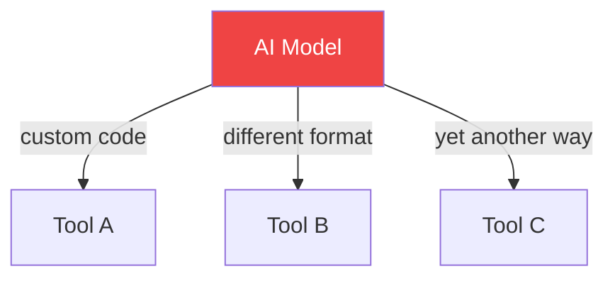

<style>
.slidev-layout pre,
.slidev-layout code {
  font-size: 0.72em !important;
  line-height: 1.5 !important;
}
</style>

# MCP Server
## & Cursor Integration

How Cursor uses Model Context Protocol to talk to your backend

<div class="pt-12">
  <span class="px-2 py-1 rounded cursor-pointer" hover="bg-white bg-opacity-10">
    Press Space to continue →
  </span>
</div>

---
layout: default
---

# Agenda

<div class="grid grid-cols-2 gap-8 mt-8">
<div>

### 🧠 Part 1 — What is MCP?
- The problem MCP solves
- Core concepts & architecture
- MCP vs traditional APIs

</div>
<div>

### ⚡ Part 2 — Cursor & MCP
- How Cursor acts as MCP client
- Request lifecycle
- Live demo flow

</div>
</div>

<div class="mt-10 p-4 rounded-lg text-white" style="background: #1e3a5f; border: 1px solid #3b82f6;">
  <b>Goal:</b> By the end, you'll understand how an AI IDE like Cursor can securely call your own backend — through a structured, tool-based protocol.
</div>

---
layout: section
---

# Part 1
## What is MCP?

---
layout: two-cols
---

# The Problem

Before MCP, connecting AI to tools was **chaos**:

- Every tool had a custom integration
- No standard format for tool descriptions
- Security & auth handled ad-hoc
- Context passed manually by the developer



::right::

<div class="pl-8 mt-12">

### Result 😩

- Fragile integrations
- Hard to maintain
- Not portable across AI tools
- Reinventing the wheel every time

<div class="mt-6 p-3 rounded text-white" style="background: #7f1d1d; border: 1px solid #ef4444;">
  Each AI + Tool pair required a <b>bespoke bridge</b>. No reuse. No standard.
</div>

</div>

---
layout: default
---

# What is MCP?

**Model Context Protocol** (MCP) is an open standard by Anthropic that defines how AI models communicate with external tools and data sources.

<div class="grid grid-cols-3 gap-6 mt-8">

<div class="p-5 rounded-xl text-white" style="background: #4c1d95; border: 1px solid #7c3aed;">
  <div class="text-3xl mb-3">📐</div>
  <div class="font-bold text-lg mb-2">Standard Protocol</div>
  <p class="text-sm opacity-90">One universal interface for all AI ↔ Tool connections</p>
</div>

<div class="p-5 rounded-xl text-white" style="background: #1e3a5f; border: 1px solid #3b82f6;">
  <div class="text-3xl mb-3">🔌</div>
  <div class="font-bold text-lg mb-2">Plug & Play</div>
  <p class="text-sm opacity-90">Any MCP client works with any MCP server — like USB</p>
</div>

<div class="p-5 rounded-xl text-white" style="background: #14532d; border: 1px solid #22c55e;">
  <div class="text-3xl mb-3">🔒</div>
  <div class="font-bold text-lg mb-2">Secure by Design</div>
  <p class="text-sm opacity-90">Structured auth, scoped permissions, no prompt injection</p>
</div>

</div>

<div class="mt-8 p-4 rounded-lg font-mono text-sm text-white" style="background: #1e1e2e; border: 1px solid #444;">
  <b>Think of it as:</b> <span style="color: #a78bfa;">USB-C for AI tools</span> — one standard connector, any device, any brand.
</div>

---
layout: default
---

# MCP Architecture

```
┌─────────────────────────────────────────────────────────────┐
│                        MCP HOST                             │
│   (e.g. Cursor, Claude Desktop, VS Code extension)          │
│                                                             │
│   ┌─────────────┐          ┌───────────────────────────┐   │
│   │  AI Model   │◄────────►│      MCP Client           │   │
│   │ (LLM Core)  │  tools   │  (protocol layer)         │   │
│   └─────────────┘          └─────────────┬─────────────┘   │
└────────────────────────────────────────── │ ────────────────┘
                                            │  JSON-RPC 2.0
                          ┌─────────────────▼──────────────┐
                          │         MCP SERVER             │
                          │                                │
                          │  • Tool definitions            │
                          │  • Resource providers          │
                          │  • Prompt templates            │
                          │                                │
                          └─────────────────┬──────────────┘
                                            │
                          ┌─────────────────▼──────────────┐
                          │          YOUR BACKEND           │
                          │  (REST API / DB / Service)      │
                          └────────────────────────────────┘
```

---
layout: default
---

# MCP Core Concepts — Overview

MCP exposes your backend through **3 primitives** the AI can use:

<div class="grid grid-cols-3 gap-6 mt-8">

<div class="p-5 rounded-xl text-white" style="background: #4c1d95; border: 1px solid #7c3aed;">
  <div class="text-3xl mb-3">🛠 Tools</div>
  <div class="font-bold mb-2">Actions the AI can execute</div>
  <p class="text-sm opacity-90">Like calling a REST endpoint. The AI decides when and how to call them based on the user's intent.</p>
  <div class="mt-3 text-xs opacity-70 font-mono">→ POST /orders, GET /users/:id</div>
</div>

<div class="p-5 rounded-xl text-white" style="background: #1e3a5f; border: 1px solid #3b82f6;">
  <div class="text-3xl mb-3">📦 Resources</div>
  <div class="font-bold mb-2">Data the AI can read</div>
  <p class="text-sm opacity-90">Like a GET endpoint that returns structured data — files, DB records, docs — addressable by URI.</p>
  <div class="mt-3 text-xs opacity-70 font-mono">→ orders://user/42</div>
</div>

<div class="p-5 rounded-xl text-white" style="background: #14532d; border: 1px solid #22c55e;">
  <div class="text-3xl mb-3">💬 Prompts</div>
  <div class="font-bold mb-2">Reusable instruction templates</div>
  <p class="text-sm opacity-90">Pre-written prompts with arguments that guide the AI to perform a task consistently every time.</p>
  <div class="mt-3 text-xs opacity-70 font-mono">→ "Summarize order {orderId}"</div>
</div>

</div>

---
layout: two-cols
---

# 🛠 Tools — The OpenAPI Bridge

Your existing REST API maps **directly** to MCP tools:

```yaml
# OpenAPI 3.0
paths:
  /orders:
    get:
      operationId: get_user_orders
      summary: Fetch all orders for a user
      parameters:
        - name: userId
          in: query
          required: true
          schema:
            type: string
      responses:
        '200':
          description: List of orders
          content:
            application/json:
              schema:
                type: array
                items:
                  $ref: '#/components/schemas/Order'
```

::right::

<div class="pl-8">

```json
// MCP Tool — same operation
{
  "name": "get_user_orders",
  "description": "Fetch all orders for a user",
  "inputSchema": {
    "type": "object",
    "properties": {
      "userId": {
        "type": "string",
        "description": "The user ID"
      }
    },
    "required": ["userId"]
  }
}
```

<div class="mt-4 p-3 rounded-lg text-white text-sm" style="background:#1e293b; border:1px solid #475569;">
  <b>Key insight:</b> MCP doesn't replace your REST API. The tool definition is just the <em>contract</em> — the MCP server still calls <code>GET /orders?userId=…</code> under the hood.
</div>

</div>

---
layout: default
---

# 🛠 Tools — Cursor ↔ MCP Dialog

Here's the actual JSON-RPC exchange when Cursor calls a tool:

<div class="grid grid-cols-2 gap-6 mt-4">

<div>

**1. Cursor asks: what tools exist?**
```json
// Cursor → MCP Server
{
  "jsonrpc": "2.0",
  "method": "tools/list",
  "id": 1
}

// MCP Server → Cursor
{
  "jsonrpc": "2.0",
  "result": {
    "tools": [
      { "name": "get_user_orders", ... },
      { "name": "create_order", ... }
    ]
  },
  "id": 1
}
```

</div>

<div>

**2. LLM decides to call a tool**
```json
// Cursor → MCP Server
{
  "jsonrpc": "2.0",
  "method": "tools/call",
  "params": {
    "name": "get_user_orders",
    "arguments": { "userId": "42" }
  },
  "id": 2
}

// MCP Server → Cursor
{
  "jsonrpc": "2.0",
  "result": {
    "content": [{
      "type": "text",
      "text": "[{\"id\":\"o1\",\"total\":59.99}]"
    }]
  },
  "id": 2
}
```

</div>
</div>

---
layout: two-cols
---

# 📦 Resources — Read-Only Context

Resources are **data the AI reads passively** — not actions, but context. Think of them as addressable GET endpoints the AI can subscribe to.

<div class="mt-4 p-3 rounded-lg text-white text-sm" style="background:#1e293b; border:1px solid #3b82f6;">
  <b>Tool vs Resource:</b><br/>
  🛠 Tool = <em>"Do something"</em> (has side effects)<br/>
  📦 Resource = <em>"Give me data"</em> (read-only, no side effects)
</div>

```json
// Cursor → MCP: list available resources
{ "method": "resources/list" }

// MCP Server → Cursor
{
  "resources": [
    {
      "uri": "orders://user/42",
      "name": "Orders for user 42",
      "description": "All orders placed by user 42",
      "mimeType": "application/json"
    }
  ]
}
```

::right::

<div class="pl-8">

```json
// Cursor → MCP: read a resource
{
  "method": "resources/read",
  "params": { "uri": "orders://user/42" }
}

// MCP Server → Cursor
{
  "contents": [{
    "uri": "orders://user/42",
    "mimeType": "application/json",
    "text": "[{\"id\":\"o1\",\"total\":59.99,
              \"status\":\"shipped\"}]"
  }]
}
```

<div class="mt-4 p-3 rounded-lg text-white text-sm" style="background:#1e3a5f; border:1px solid #3b82f6;">
  <b>Real-world examples:</b>
  <ul class="mt-2 space-y-1 text-xs opacity-90">
    <li>📄 <code>file:///src/schema.prisma</code> — your DB schema</li>
    <li>🗄 <code>db://products/catalog</code> — product list</li>
    <li>📋 <code>doc://runbook/deploy</code> — a deployment guide</li>
  </ul>
</div>

</div>

---
layout: two-cols
---

# 💬 Prompts — Reusable Instructions

Prompts are **pre-written instruction templates** stored on the MCP server. They ensure the AI always approaches a task the same way — with your business logic baked in, not typed ad-hoc by each user.

```json
// MCP Server exposes this prompt
{
  "name": "summarize_order",
  "description": "Generate a customer-friendly order summary",
  "arguments": [
    {
      "name": "orderId",
      "description": "The order to summarize",
      "required": true
    },
    {
      "name": "language",
      "description": "Response language (default: en)",
      "required": false
    }
  ]
}
```

::right::

<div class="pl-8">

**When Cursor calls this prompt:**

```json
// Cursor → MCP
{
  "method": "prompts/get",
  "params": {
    "name": "summarize_order",
    "arguments": {
      "orderId": "o-789",
      "language": "fr"
    }
  }
}

// MCP Server expands it into:
{
  "messages": [{
    "role": "user",
    "content": "Summarize order o-789 for
      the customer in French. Include:
      items ordered, total, delivery date.
      Tone: friendly and concise."
  }]
}
```

<div class="mt-4 p-3 rounded-lg text-white text-sm" style="background:#14532d; border:1px solid #22c55e;">
  <b>Why this matters:</b> The business logic lives in <em>your server</em>, not in the user's chat prompt. Every team member gets the same high-quality, consistent output.
</div>

</div>

---
layout: default
---

# MCP Transport Layer

MCP servers communicate using **JSON-RPC 2.0** over different transports:

<div class="grid grid-cols-3 gap-6 mt-6">

<div class="p-4 rounded-xl text-white" style="background: #1e293b; border: 1px solid #475569;">
  <div class="font-bold text-lg mb-2">🖥 stdio</div>
  <p class="text-sm opacity-90">Standard input/output. Used for <b>local processes</b>. Cursor spawns the MCP server as a child process.</p>
  <div class="mt-3 text-xs p-2 rounded font-mono" style="background:#0f172a;">cursor → spawn → mcp-server</div>
</div>

<div class="p-4 rounded-xl text-white" style="background: #1e3a5f; border: 1px solid #3b82f6;">
  <div class="font-bold text-lg mb-2">🌐 HTTP + SSE</div>
  <p class="text-sm opacity-90">Server-Sent Events for streaming. Used for <b>remote servers</b> over the network.</p>
  <div class="mt-3 text-xs p-2 rounded font-mono" style="background:#0f172a;">cursor → https://api.you.com/mcp</div>
</div>

<div class="p-4 rounded-xl text-white" style="background: #14532d; border: 1px solid #22c55e;">
  <div class="font-bold text-lg mb-2">🔌 WebSocket</div>
  <p class="text-sm opacity-90">Bidirectional. Used for <b>persistent connections</b> with real-time updates.</p>
  <div class="mt-3 text-xs p-2 rounded font-mono" style="background:#0f172a;">cursor ⇄ ws://localhost:3100</div>
</div>

</div>

<div class="mt-6 p-3 rounded text-sm text-white" style="background: #78350f; border: 1px solid #f59e0b;">
  ⚡ <b>For Cursor + local backend:</b> <code>stdio</code> is most common. For deployed backends: <b>HTTP + SSE</b>.
</div>

---
layout: section
---

# Part 2
## Cursor & MCP in Action

---
layout: default
---

# Cursor as an MCP Client

Cursor is an **MCP Host** — it embeds an MCP client that can connect to multiple MCP servers simultaneously.

```
~/.cursor/mcp.json  (or  .cursor/mcp.json  in your project)
```

```json
{
  "mcpServers": {
    "my-backend": {
      "command": "node",
      "args": ["./mcp-server/index.js"],
      "env": {
        "BACKEND_URL": "http://localhost:8080",
        "API_KEY": "secret-key"
      }
    },
    "filesystem": {
      "command": "npx",
      "args": ["-y", "@modelcontextprotocol/server-filesystem", "./src"]
    }
  }
}
```

<div class="text-sm text-gray-500 mt-2">Cursor reads this config, spawns the servers, and makes their tools available to the AI.</div>

---
layout: default
---

# The Full Request Lifecycle

<div class="mt-4">

```
USER (in Cursor chat)
│
│  "Hey, fetch the latest orders for user ID 42 and summarize them"
│
▼
CURSOR / LLM
│  • Sees available tools from MCP servers
│  • Decides: I need to call `get_user_orders` with { userId: "42" }
│
▼
MCP CLIENT (inside Cursor)
│  • Sends JSON-RPC request to MCP server
│  { "method": "tools/call", "params": { "name": "get_user_orders", "arguments": { "userId": "42" } } }
│
▼
MCP SERVER (your Node.js / Python process)
│  • Validates the call
│  • Calls YOUR backend: GET http://localhost:8080/api/orders?userId=42
│
▼
YOUR BACKEND (REST API / DB)
│  • Returns order data as JSON
│
▼
MCP SERVER  →  MCP CLIENT  →  LLM
│  • LLM receives the data as tool result
│  • LLM generates a natural language summary
│
▼
USER  ✅  "User 42 has 3 orders. The latest one is..."
```

</div>

---
layout: two-cols
---

# Building an MCP Server

### Using the official SDK (TypeScript)

```typescript
import { Server } from "@modelcontextprotocol/sdk/server/index.js";
import { StdioServerTransport } from "@modelcontextprotocol/sdk/server/stdio.js";

const server = new Server({
  name: "my-backend-mcp",
  version: "1.0.0",
}, {
  capabilities: { tools: {} }
});

// Register a tool
server.setRequestHandler(ListToolsRequestSchema, async () => ({
  tools: [{
    name: "get_user_orders",
    description: "Fetch orders for a user",
    inputSchema: {
      type: "object",
      properties: {
        userId: { type: "string", description: "User ID" }
      },
      required: ["userId"]
    }
  }]
}));
```

::right::

<div class="pl-6">

```typescript
// Handle tool execution
server.setRequestHandler(
  CallToolRequestSchema,
  async (request) => {
    if (request.params.name === "get_user_orders") {
      const { userId } = request.params.arguments;

      // Call your actual backend
      const res = await fetch(
        `${process.env.BACKEND_URL}/api/orders?userId=${userId}`,
        { headers: { "x-api-key": process.env.API_KEY } }
      );
      const orders = await res.json();

      return {
        content: [{
          type: "text",
          text: JSON.stringify(orders, null, 2)
        }]
      };
    }
  }
);

// Start the server
const transport = new StdioServerTransport();
await server.connect(transport);
```

</div>

---
layout: default
---

# Security Considerations

<div class="grid grid-cols-2 gap-6 mt-6">

<div class="p-5 rounded-xl text-white" style="background: #14532d; border: 1px solid #22c55e;">
  <div class="font-bold text-lg mb-3">✅ MCP Security Model</div>
  
  - **Tool scoping**: Cursor only sees tools you explicitly expose
  - **Process isolation**: MCP server runs as a separate process
  - **Env-based secrets**: API keys stay in env vars, never in prompts
  - **Schema validation**: Input is validated before reaching your backend
  - **User approval**: Cursor asks users before executing sensitive tools
</div>

<div class="p-5 rounded-xl text-white" style="background: #7c2d12; border: 1px solid #f97316;">
  <div class="font-bold text-lg mb-3">⚠️ Best Practices</div>
  
  - Always validate `userId` ownership server-side
  - Use **read-only** tools by default; require confirmation for writes
  - Log all MCP tool invocations for audit
  - Scope API keys to minimum required permissions
  - Never expose internal service credentials via tool descriptions
</div>

</div>

---
layout: default
---

# Example: Complete Flow Diagram

```
Cursor IDE
┌─────────────────────────────────────────┐
│  Chat: "Get orders for user 42"         │
│                                         │
│  ┌─────────────────┐                    │
│  │   Claude / GPT  │ ◄── tool manifest  │
│  │   (LLM Core)    │                    │
│  └────────┬────────┘                    │
│           │ tools/call                  │
│  ┌────────▼────────┐                    │
│  │   MCP Client    │                    │
│  └────────┬────────┘                    │
└───────────│─────────────────────────────┘
            │ JSON-RPC (stdio or HTTP)
┌───────────▼─────────────────────────────┐
│         MCP SERVER  (your code)         │
│  • Parses tool call                     │
│  • Authenticates                        │
│  • Calls backend                        │
└───────────┬─────────────────────────────┘
            │ HTTP / gRPC / DB query
┌───────────▼─────────────────────────────┐
│         YOUR BACKEND                    │
│  GET /api/orders?userId=42              │
│  ← { orders: [...] }                   │
└─────────────────────────────────────────┘
```

---
layout: default
---

# Quick Start Checklist

<div class="grid grid-cols-2 gap-6 mt-4">
<div>

### 1️⃣ Create your MCP server
```bash
mkdir mcp-server && cd mcp-server
npm init -y
npm install @modelcontextprotocol/sdk
# Write index.ts with your tools
```

### 2️⃣ Configure Cursor
```bash
# In your project root:
mkdir .cursor
touch .cursor/mcp.json
# Add your server config
```

</div>
<div>

### 3️⃣ Test with MCP Inspector
```bash
npx @modelcontextprotocol/inspector \
  node ./mcp-server/index.js
```

### 4️⃣ Enable in Cursor Settings
```
Cursor → Settings → Features
→ MCP Servers → ✅ Enable
→ Restart Cursor
```

</div>
</div>

<div class="mt-6 p-4 rounded-xl text-white" style="background: #4c1d95; border: 1px solid #7c3aed;">
  💡 <b>Tip:</b> Use <code>console.error()</code> (not <code>console.log</code>) for debug output in stdio MCP servers — stdout is reserved for the JSON-RPC protocol!
</div>

---
layout: default
---

# Summary

<div class="grid grid-cols-3 gap-6 mt-6">

<div class="p-5 rounded-xl text-white text-center" style="background: #4c1d95; border: 1px solid #7c3aed;">
  <div class="text-4xl mb-3">📐</div>
  <b>MCP</b>
  <p class="text-sm mt-2 opacity-90">A universal protocol that lets AI models call external tools in a structured, secure way</p>
</div>

<div class="p-5 rounded-xl text-white text-center" style="background: #1e3a5f; border: 1px solid #3b82f6;">
  <div class="text-4xl mb-3">⚡</div>
  <b>Cursor</b>
  <p class="text-sm mt-2 opacity-90">Acts as MCP Host — it connects to your MCP servers and gives the AI access to their tools</p>
</div>

<div class="p-5 rounded-xl text-white text-center" style="background: #14532d; border: 1px solid #22c55e;">
  <div class="text-4xl mb-3">🔗</div>
  <b>Your Backend</b>
  <p class="text-sm mt-2 opacity-90">Stays untouched — the MCP server is a thin adapter that bridges the AI to your existing API</p>
</div>

</div>

<div class="mt-8 text-center">

### Flow in one line:
`Cursor Chat → LLM → MCP Client → MCP Server → Your Backend → Response → LLM → User`

</div>

---
layout: center
class: text-center
---

# Thank You!

### Resources

<div class="grid grid-cols-3 gap-4 mt-8 text-sm">

<div class="p-3 rounded-lg text-white" style="background: #1e293b; border: 1px solid #475569;">
  <b>Official Docs</b><br/>
  modelcontextprotocol.io
</div>

<div class="p-3 rounded-lg text-white" style="background: #1e293b; border: 1px solid #475569;">
  <b>SDK</b><br/>
  github.com/modelcontextprotocol/typescript-sdk
</div>

<div class="p-3 rounded-lg text-white" style="background: #1e293b; border: 1px solid #475569;">
  <b>Cursor Docs</b><br/>
  docs.cursor.com/context/model-context-protocol
</div>

</div>

<div class="mt-10 text-gray-400 text-sm">
  Built with <a href="https://sli.dev" class="text-blue-400">Slidev</a> — presentation slides for developers
</div>
